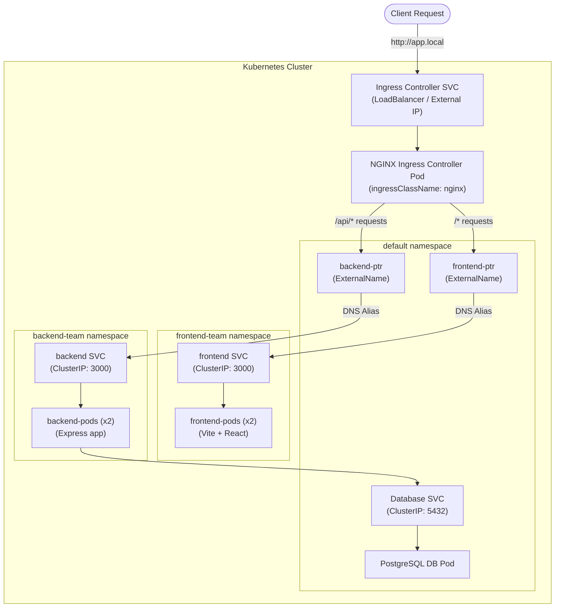

# Standard Ingress Controller with namespaces & local Kind configuration

This project demonstrates how to deploy a multi-tier, multi-namespace application on a local **Kind (Kubernetes in Docker)** cluster using an official **NGINX Ingress Controller** (rather than a manually built reverse proxy).

## Architecture



### Key Highlights
1. **Official Ingress Controller:** Traffic enters the cluster through the standard `ingressClassName: nginx` controller.
2. **Cross-Namespace Routing via Pointers:** Since the Ingress resource is defined in the `default` namespace, and the frontend/backend services reside in separate namespaces, we use `ExternalName` services (`frontend-ptr` and `backend-ptr`) in the `default` namespace to map cross-namespace DNS:
   - `frontend-ptr` aliases to `frontend.frontend-team.svc.cluster.local`
   - `backend-ptr` aliases to `backend.backend-team.svc.cluster.local`
3. **Regex Path Rewriting:** The ingress annotation `nginx.ingress.kubernetes.io/rewrite-target: /$2` strips the `/api` prefix from API requests before forwarding them to the backend (e.g. `/api/users` -> `/users`).

---

## Understanding the Ingress Manifest (`ingress/manifest.yml`)

The Ingress manifest is broken down into two main parts: the **Pointers** and the **Ingress Router**.

### 1. The Pointers (`type: ExternalName`)
* **What they are:** DNS aliases (`frontend-ptr` and `backend-ptr`) created inside the `default` namespace.
* **Why we do it:** Kubernetes Ingress rules can only send traffic to Services in the **same namespace** as the Ingress resource. Since our actual frontend and backend services are in `frontend-team` and `backend-team` namespaces, we use these pointers in the `default` namespace to act as bridges.

### 2. The Ingress Annotations
* `nginx.ingress.kubernetes.io/use-regex: "true"`
  * **What:** Enables regular expressions in Ingress paths.
  * **Why:** Necessary for capturing the variable part of the request path.
* `nginx.ingress.kubernetes.io/rewrite-target: /$2`
  * **What:** Instructs Nginx to rewrite the request URL using the second regex capturing group `(.*)`.
  * **Why:** This strips the `/api` prefix so the backend receives `/users` instead of `/api/users`.

### 3. The Rules & Paths
* `host: app.local`: Ingress only routes requests if the `Host` header in the incoming request is `app.local`.
* **Path 1 (`/api(/|$)(.*)`):** Matches any URL starting with `/api/` (like `/api/users`). It routes this traffic to `backend-ptr` (port 3000), while stripping `/api`.
* **Path 2 (`/()(.*)`):** Matches all other requests (like `/`, `/index.html`, `/assets/*`). It routes this traffic to `frontend-ptr` (port 3000).

---

## Kind Cluster Port Mapping (`kind.yml`)

Because we are running locally inside Docker container nodes, external traffic from the host machine (your Mac) needs a way to reach the cluster nodes if direct routing is not configured.

The [kind.yml](file:///Users/dev-rvk/Desktop/Data/kubernetes/lec2/kind.yml) exposes port `30007` on your Mac host machine and routes it directly to container port `30007` on the control-plane and worker node containers.

---

## Step-by-Step Deployment

### 1. Create the Kind Cluster
Create a new cluster using the custom configuration:
```bash
kind create cluster --config kind.yml --name lec2-cluster
```

### 2. Install NGINX Ingress Controller
Install the official NGINX Ingress Controller on your cluster:
```bash
kubectl apply -f https://raw.githubusercontent.com/kubernetes/ingress-nginx/main/deploy/static/provider/kind/deploy.yaml
```
*(Wait for the ingress controller pods to be fully ready before proceeding)*.

### 3. Deploy the Application Components
Apply the database, backend, and frontend manifests:
```bash
kubectl apply -f db/manifest.yml
kubectl apply -f backend/manifest.yml
kubectl apply -f frontend/manifest.yml
```

### 4. Deploy Ingress & ExternalName Services
Apply the ingress rules and pointers:
```bash
kubectl apply -f ingress/manifest.yml
```

---

## Accessing the App

### Option A: Direct IP Routing (Recommended if accessible)
If you can reach the Ingress controller service IP directly from your machine (e.g., via `minikube tunnel`, Docker routing tools, or native Linux bridge):

1. **Find the External/Cluster IP of the ingress service:**
   ```bash
   kubectl get svc -n ingress-nginx
   ```
2. **Update your `/etc/hosts` file:**
   Point `app.local` directly to that IP:
   ```text
   <INGRESS_SVC_IP>  app.local
   ```
3. **Access the application:**
   Navigate in your browser to:
   ```
   http://app.local
   ```

---

### Option B: Local Port Mapping (Fallback)
If the IP is not directly accessible (e.g., standard Docker Desktop for Mac):

1. **Update your `/etc/hosts` file:**
   Point `app.local` to localhost (`127.0.0.1`):
   ```text
   127.0.0.1  app.local
   ```
2. **Access the application using hostPort `30007`:**
   Navigate in your browser to:
   ```
   http://app.local:30007
   ```
   Your browser sends `Host: app.local` to localhost on port `30007`, Kind routes it to the Ingress controller inside the node container, and Nginx forwards the traffic correctly.

---

## How to Do This Better in Production

While `ExternalName` pointers and path rewrites work, they introduce extra configuration complexity. In production enterprise architectures, teams use these cleaner patterns:

### 1. Split Ingress Resources (Multi-Ingress)
Instead of forcing a single Ingress file in the `default` namespace with `ExternalName` pointers, you should create separate Ingress resources in each team's namespace. The NGINX Ingress controller automatically merges them:

* **In `frontend-team` Namespace:**
  ```yaml
  apiVersion: networking.k8s.io/v1
  kind: Ingress
  metadata:
    name: frontend-ingress
    namespace: frontend-team
  spec:
    ingressClassName: nginx
    rules:
    - host: app.local
      http:
        paths:
        - path: /
          pathType: Prefix
          backend:
            service:
              name: frontend
              port:
                number: 3000
  ```

* **In `backend-team` Namespace:**
  ```yaml
  apiVersion: networking.k8s.io/v1
  kind: Ingress
  metadata:
    name: backend-ingress
    namespace: backend-team
    annotations:
      nginx.ingress.kubernetes.io/use-regex: "true"
      nginx.ingress.kubernetes.io/rewrite-target: /$2
  spec:
    ingressClassName: nginx
    rules:
    - host: app.local
      http:
        paths:
        - path: /api(/|$)(.*)
          pathType: ImplementationSpecific
          backend:
            service:
              name: backend
              port:
                number: 3000
  ```
* **Why this is better:** It keeps configuration fully localized. The frontend team controls their routes, and the backend team controls theirs.

### 2. Native Path Routing (No Rewrites)
Update your backend application code to mount all endpoints under `/api` (e.g. `app.use('/api', router)` in Express).
* **Why this is better:** It eliminates the complex regex rewriting annotations (`rewrite-target: /$2`), preventing route-matching bugs and making ingress resources much simpler to read and maintain.

### 3. Kubernetes Gateway API
The newer **Kubernetes Gateway API** is replacing Ingress. It defines cluster entrypoints (`Gateway`) separately from routing logic (`HTTPRoute`).
* **Why this is better:** A platform admin deploys the `Gateway` in the `infra` namespace, and development teams simply create `HTTPRoute` resources in their own namespaces pointing to their apps. It has built-in cross-namespace support without any hacks.
